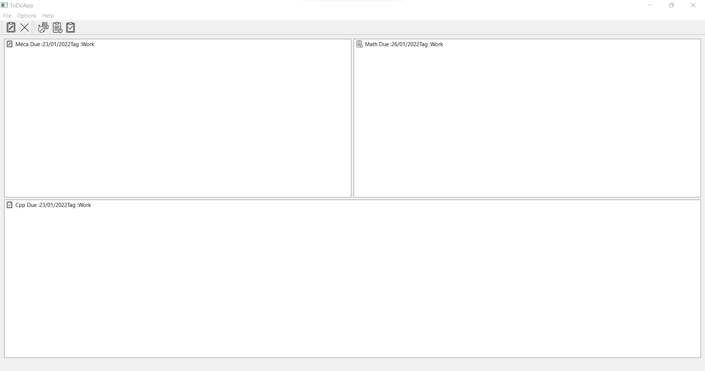
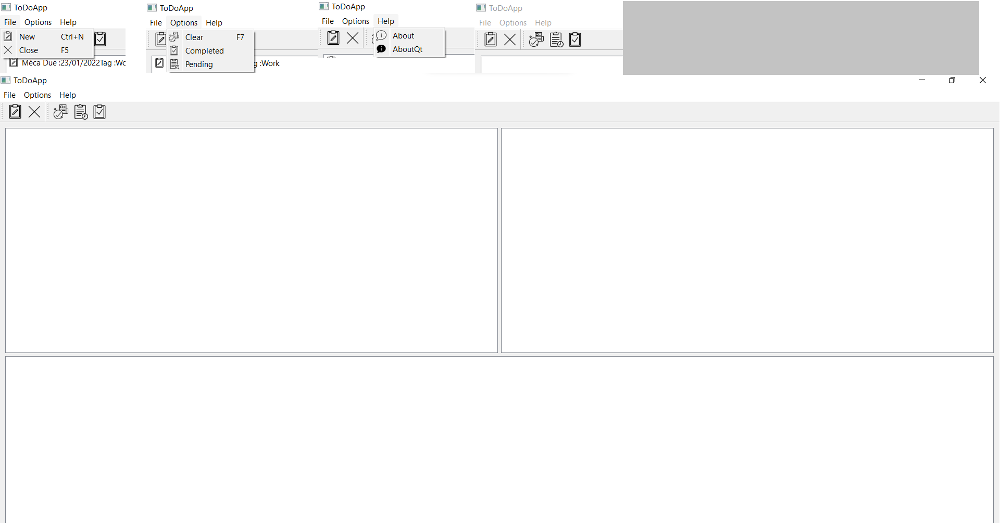

## TODO Application using containers
create a versatile ToDo app using (Item/Model) based containers
- [Introduction](#INTRO)
- [ItemBasedModel](#ItemBaseModel)
- [MVCModel](#MVCModel)

<div id = "back"></div>


  
## **Introduction** 

<a name="INTRO"></a>

**Widgets** are the primary elements for creating user interfaces in Qt. Widgets can display data and status information, receive user input, and provide a container for other widgets that should be grouped together. A widget that is not embedded in a parent widget is called a window.

A **Container** is a holder object that stores a collection of other objects(its elements). They are implemented as class templates, which allows a great flexibility in the types supported as elements. It replicate structures very commonly used in programming : dynamic arrays(vector), queues, stacks, heaps, linked list, trees, maps... We will check three basic containers which are list, tree and table, and for each one we will check two variant Item Based and Model Based.

The **QTableWidget** class provides an item-based table view with a default model. Table widgets provide standard table display facilities for applications. The items in a QTableWidget are provided by QTableWidgetItem.

A **QListWidget** is a convenience class that provides a list view similar to the one supplied by QListView, but with a classic item-based interface for adding and removing items. QListWidget uses an internal model to manage each QListWidgetItem in the list.

The **QTreeWidget class** is a convenience class that provides a standard tree widget with a classic item-based interface similar to that used by the QListView class in Qt 3. This class is based on Qt's Model/View architecture and uses a default model to hold items, each of which is a QTreeWidgetItem.

The **QTableView** class provides a default **Model/View** implementation of a table view. It implements a table view that displays items from a model. This class is used to provide standard tables that were previously provided by the QTable class, but using the more flexible approach provided by Qt's model/view architecture.The QTableView class is one of the Model/View Classes and is part of Qt's model/view framework. It implements the interfaces defined by the QAbstractItemView class to allow it to display data provided by models derived from the QAbstractItemModel class.


**Model–view–controller (MVC)** is a software design pattern commonly used for developing user interfaces that divide the related program logic into three interconnected elements. MVC consists of three kinds of objects. The Model is the application object, the View is its screen presentation, and the Controller defines the way the user interface reacts to user input. Before MVC, user interface designs tended to lump these objects together. MVC decouples them to increase flexibility and reuse.


 >**In This Zip you will have the project** [Homework4.zip]() 
 
 [(**Back to top**)](#back)
 
### ToDoApp

We will create an application to manage tasks. It will have all the features of main application such as menus, actions and toolbar. The application stores an archive of all the pending and finished tasks.


### Item Based Model

<a name="ItemBasedModel"></a>

In the Item Based Model, We wrote the code for the graphical and set of actions , now we will write a set of basic functionality. we will start with the connections made for our application:

1.we add the function for the newTask action,we created a Dialog for the user to add tasks, for that, first we created a Form Class, we use the designer and we obtain the form of AddNew, in addition we added some methods to get the content of our line Edit, checkBox, comboBox and the Date Edit. Here is the Form of Add new task:


first we add those lines to the header file of the dialog class :
```javascript
class Dialog1 : public QDialog
{
    Q_OBJECT

public:
    explicit Dialog1(QWidget *parent = nullptr);
    ~Dialog1();
    void taskDialog();
    bool isChecked();
    void setdate(int a,int m, int j);
    void task(QString t);
    void tag(QString a);
    void finished(bool f);
    QDate getDate();
    QString getText();

private:
    Ui::Dialog1 *ui;
};
```
and in the cpp file we implement our methods:
```javascript
Dialog1::Dialog1(QWidget *parent) :
    QDialog(parent),
    ui(new Ui::Dialog1)
{
    ui->setupUi(this);
    QDate date =QDate::currentDate();

    ui->dateEdit->setMinimumDate(date);

    ui->dateEdit->setDate(date);
}

Dialog1::~Dialog1()
{
    delete ui;
}
void Dialog1::setdate(int a, int m, int j){

    QDate d;


    d.setDate(a,m,j);

    ui->dateEdit->setDate(d);

}
void Dialog1::task(QString t){
    ui->lineEdit->setText(t);
}
void Dialog1::tag(QString a){
    ui->comboBox->setCurrentText(a);
}

void Dialog1::finished(bool f){
    ui->checkBox->setChecked(f);

}
bool Dialog1::isChecked(){
    if(ui->checkBox->isChecked()){
        return true;
    }
    return false;
}
QDate Dialog1::getDate(){
    return ui->dateEdit->date();
}
QString Dialog1::getText(){
    QString a= ui->lineEdit->text()+"Due :" + ui->dateEdit->text() + "Tag :" + ui->comboBox->currentText() + "";
    return a;
}
```

In addition,we have declared a private slot called Newtask 

```javascript
private slots:
    void NewTask();
```
We created a connexion between the newtask action and the method : 


```javascript
connect(newtask,&QAction::triggered,this,&toDoApp::NewTask);
```

Then, we implement the function in the cpp file:

```javascript
void toDoApp::NewTask()
{

    Dialog1 dialog;
    auto replu = dialog.exec();
    if(replu==Dialog1::Accepted){
        QString text = dialog.getText();
        if(dialog.getDate()==QDate::currentDate() && !dialog.isChecked()){
            QIcon TodayIcon(":/Todayicon.png");

            ui->pesistent->addItem(new QListWidgetItem(TodayIcon,text));
        }
        else if(dialog.getDate()!=QDate::currentDate() && !dialog.isChecked()){
            QIcon pendingIcon(":/pending_icon.png");

            ui->Pending->addItem(new QListWidgetItem(pendingIcon,text));
        }
        else if(dialog.isChecked()){
            QIcon completedIcon(":/completed_icon.png");

            ui->completed->addItem(new QListWidgetItem(completedIcon,text));
        }
    }


}
```

2.We added a closeEvent that save the data in a file 
  First, we declare the slots in the header file
  
  ```javascript
protected:
    void closeEvent(QCloseEvent *e) override;

```
Then we implement the function in the cpp file :
  ```javascript
void toDoApp::closeEvent(QCloseEvent *e){

    QFile file("/Users/hp/Desktop/save.txt");
    if (file.open(QIODevice::ReadWrite| QIODevice::Text)){

        QTextStream out(&file);
        for (int i=0;i<ui->pesistent->count() ;i++ ) {
            out<< "1"<< ui->pesistent->item(i)->text() << Qt::endl;
        }
        for (int i=0;i<ui->Pending->count() ;i++ ) {
            out<< "2"<< ui->pesistent->item(i)->text() << Qt::endl;
        }
        for (int i=0;i<ui->completed->count() ;i++ ) {
            out<< "3"<< ui->pesistent->item(i)->text() << Qt::endl;
        }
        file.close();
    }
}

```


3.For open the previous data , we added some line to open our file.txt
```javascript
QFile file("/Users/hp/Desktop/save.txt");
    if (!file.open(QIODevice::ReadOnly | QIODevice::Text))
        return;

    while (!file.atEnd()) {
        QString line = file.readLine();
        if(line.at(0)== "1"){
            ui->pesistent->addItem(line.mid(1,line.size()));
        }else if(line.at(0)== "2"){
             ui->Pending->addItem(line.mid(1,line.size()));
        }else if(line.at(0)== "3"){
            ui->completed->addItem(line.mid(1,line.size()));

        }
    }

```
 [(**Back to top**)](#back)

4. we added a slots called Pending slot and completed slot
First, we declare the slots in the header file
```javascript
private slots:
    void PendingSlot();
private slots:
    void CompletedSlot();

```
Then we implement the function in the cpp file :

```javascript
void toDoApp::PendingSlot(){
    if(ui->Pending->isVisible()){
        ui->Pending->hide();
}else{
   ui->Pending->show();
    }
}

void toDoApp::CompletedSlot(){
    if(ui->completed->isVisible()){
        ui->completed->hide();
}else{
   ui->completed->show();
    }
}
```
We add the connexion of these slots to enable the actions to show or hide our listWidget
```javascript
connect(pending,&QAction::triggered,this,&toDoApp::PendingSlot);
connect(completed,&QAction::triggered,this,&toDoApp::CompletedSlot);
```

 [(**Back to top**)](#back)

5. we added a slots called quit to close the window, and the about and aboutQt slots:

First, we declare the slots in the header file
```javascript
private slots:
    void quit();
    void aboutslot();
    void aboutQtslot();
 
```
Then we implement the functions in the cpp file 
```javascript
void toDoApp::quit(){
    auto reply = QMessageBox::question(this, "Exit","Do you really want to quit?");
    if(reply == QMessageBox::Yes)
        qApp->exit();
}
void toDoApp::aboutslot(){
    QMessageBox::about(this,"about","to do app is an app to manage tasks");;
}
void toDoApp::aboutQtslot(){
    QMessageBox::aboutQt(this, "Your Qt");
}
```


6. we added a slot called clear for delete the content of our list views :
     First, we declare the slots in the header file
     
     
```javascript
private slots:
      void ClearSlot();
      
```
    
Then we implement the functions in the cpp file 
      
   ```javascript
void toDoApp::ClearSlot()
{
    ui->Pending->clear();
    ui->pesistent->clear();
    ui->completed->clear();

    QFile file("/Users/hp/Desktop/save.txt");
    if (file.open(QIODevice::ReadWrite| QIODevice::Text)){
        file.resize(0);

    }
}
```
Finally here is the code of the header file:
  ```javascript
class toDoApp : public QMainWindow
{
    Q_OBJECT

public:
    toDoApp(QWidget *parent = nullptr);
   ~toDoApp();

    
private:
    Ui::toDoApp *ui;
protected:
    void setUpMainWidget();
    void createActions();
    void makeConnexions();
    void createMenus();
    void createToolbars();
    void closeEvent(QCloseEvent *e) override;
    
private slots:
    void quit();
    void NewTask();
    void aboutslot();
    void aboutQtslot();
    void ClearSlot();
    void Firsttask();
    void secondtask();
    void thirdtask();

    void PendingSlot();
    void CompletedSlot();

private:

    QMenu *fileMenu;
    QMenu *optionsMenu;
    QMenu *HelpMenu;
    QMenu *toolsMenu;
private:
    QAction *newtask;
    QAction *completed;
    QAction *pending;
    QAction *about;
    QAction *aboutQt;
    QAction *Close;
    QAction *Clear;

private:
    QStringList Persistent;
    QStringList Pending;
    QStringList Finished;

};
```
 [(**Back to top**)](#back)

And here is the implemenation of all functions:

```javascript
toDoApp::toDoApp(QWidget *parent)
    : QMainWindow(parent)
    , ui(new Ui::toDoApp)
{

    ui->setupUi(this);
    setUpMainWidget();
    createActions();
    makeConnexions();
    createToolbars();
    createMenus();
    setWindowTitle("ToDoApp");


    QFile file("/Users/hp/Desktop/save.txt");
    if (!file.open(QIODevice::ReadOnly | QIODevice::Text))
        return;

    while (!file.atEnd()) {
        QString line = file.readLine();
        if(line.at(0)== "1"){
            ui->pesistent->addItem(line.mid(1,line.size()));
        }else if(line.at(0)== "2"){
             ui->Pending->addItem(line.mid(1,line.size()));
        }else if(line.at(0)== "3"){
            ui->completed->addItem(line.mid(1,line.size()));

        }
    }


}

toDoApp::~toDoApp()
{
    delete ui;
    delete newtask;
    delete pending;
    delete completed;
    delete about;
    delete aboutQt;
    delete Close;

    delete fileMenu;
    delete HelpMenu;
    delete optionsMenu;
    delete toolsMenu;
    delete Clear;
}
void toDoApp::createActions()
{

  QPixmap newIcon(":/newtask_icon.png");
  newtask= new QAction(newIcon,"&New",this);
  newtask->setShortcut(tr("CTRL+N"));

  QPixmap pendingIcon(":/pending_icon.png");
  pending= new QAction(pendingIcon,"&Pending",this);

  QPixmap completedIcon(":/completed_icon.png");

  completed= new QAction(completedIcon,"&Completed",this);

  QPixmap aboutIcon(":/about_icon.png");
  about= new QAction(aboutIcon,"&About",this);
  QPixmap aboutQtIcon(":/aboutQt_icon.png");
  aboutQt= new QAction(aboutQtIcon,"&AboutQt",this);

  QPixmap closeIcon(":/close_icon.png");
  Close= new QAction(closeIcon,"&Close",this);
  Close->setShortcut(tr("F5"));
  QPixmap clearIcon(":/clearicon.png");
  Clear= new QAction(clearIcon,"&Clear",this);
  Clear->setShortcut(tr("F7"));

}

void toDoApp::createMenus()
{
    fileMenu = menuBar()->addMenu("&File");
    fileMenu->addAction(newtask);
    fileMenu->addAction(Close);

    optionsMenu = menuBar()->addMenu("&Options");
    optionsMenu->addAction(Clear);
    optionsMenu->addAction(completed);
    optionsMenu->addAction(pending);

    HelpMenu= menuBar()->addMenu("&Help");
    HelpMenu->addAction(about);
    HelpMenu->addAction(aboutQt);
}
void toDoApp::createToolbars()
{

        auto toolbar1 = addToolBar("File");
        toolbar1->addAction(newtask);
        toolbar1->addAction(Close);
        auto toolbar2 = addToolBar("Options");
        toolbar2->addAction(Clear);
        toolbar2->addAction(pending);
        toolbar2->addAction(completed);
}
void toDoApp::makeConnexions()
{
    connect(Close,&QAction::triggered,this,&toDoApp::quit);
    connect(Clear,&QAction::triggered,this,&toDoApp::ClearSlot);
    connect(newtask,&QAction::triggered,this,&toDoApp::NewTask);
    connect(about,&QAction::triggered,this,&toDoApp::aboutslot);
    connect(aboutQt,&QAction::triggered,this,&toDoApp::aboutQtslot);
    connect(pending,&QAction::triggered,this,&toDoApp::PendingSlot);
    connect(completed,&QAction::triggered,this,&toDoApp::CompletedSlot);

   
}
void toDoApp::setUpMainWidget()
{


    ui->Pending->setDragDropMode(QAbstractItemView::DragDrop);
    ui->pesistent->setDragDropMode(QAbstractItemView::DragDrop);
    ui->completed->setDragDropMode(QAbstractItemView::DragDrop);
    ui->Pending->setDefaultDropAction(Qt::MoveAction);
    ui->completed->setDefaultDropAction(Qt::MoveAction);
    ui->pesistent->setDefaultDropAction(Qt::MoveAction);


}


void toDoApp::quit(){
    auto reply = QMessageBox::question(this, "Exit","Do you really want to quit?");
    if(reply == QMessageBox::Yes)
        qApp->exit();
}
void toDoApp::NewTask()
{

    Dialog1 dialog;
    auto replu = dialog.exec();
    if(replu==Dialog1::Accepted){
        QString text = dialog.getText();
        if(dialog.getDate()==QDate::currentDate() && !dialog.isChecked()){
            QIcon TodayIcon(":/Todayicon.png");

            ui->pesistent->addItem(new QListWidgetItem(TodayIcon,text));
        }
        else if(dialog.getDate()!=QDate::currentDate() && !dialog.isChecked()){
            QIcon pendingIcon(":/pending_icon.png");

            ui->Pending->addItem(new QListWidgetItem(pendingIcon,text));
        }
        else if(dialog.isChecked()){
            QIcon completedIcon(":/completed_icon.png");

            ui->completed->addItem(new QListWidgetItem(completedIcon,text));
        }
    }


}
void toDoApp::aboutslot()
{
    QMessageBox::about(this,"about","to do app is an app to manage tasks");
}
void toDoApp::aboutQtslot()
{
    QMessageBox::aboutQt(this,"Your Qt");
}

void toDoApp::PendingSlot(){
    if(ui->Pending->isVisible()){
        ui->Pending->hide();
}else{
   ui->Pending->show();
    }
}

void toDoApp::CompletedSlot(){
    if(ui->completed->isVisible()){
        ui->completed->hide();
}else{
   ui->completed->show();
    }
}


void toDoApp::closeEvent(QCloseEvent *e){

    QFile file("/Users/hp/Desktop/save.txt");
    if (file.open(QIODevice::ReadWrite| QIODevice::Text)){

        QTextStream out(&file);
        for (int i=0;i<ui->pesistent->count() ;i++ ) {
            out<< "1"<< ui->pesistent->item(i)->text() << Qt::endl;
        }
        for (int i=0;i<ui->Pending->count() ;i++ ) {
            out<< "2"<< ui->pesistent->item(i)->text() << Qt::endl;
        }
        for (int i=0;i<ui->completed->count() ;i++ ) {
            out<< "3"<< ui->pesistent->item(i)->text() << Qt::endl;
        }
        file.close();
    }
}


void toDoApp::ClearSlot()
{
    ui->Pending->clear();
    ui->pesistent->clear();
    ui->completed->clear();

    QFile file("/Users/hp/Desktop/save.txt");
    if (file.open(QIODevice::ReadWrite| QIODevice::Text)){
        file.resize(0);

    }
}


      
```




 
 The figure od Itemd Based Model 
 
 [(**Back to top**)](#back)

### MVC Model

<a name="MVCModel"></a>

In the MVC Model, We wrote the code for the actions , now we will write a set of basic functionality. we will start with the connections made for our application:
1. we created three QstringList to 
2.we add the function for the newTask action,we created a Dialog for the user to add tasks, for that, first we created a Form Class, we use the designer and we obtain the form of AddNew, in addition we added some methods to get the content of our line Edit, checkBox, comboBox and the Date Edit. Here is the Form of Add new task:


first we add those lines to the header file of the dialog class :
```javascript
namespace Ui {
class Dialog1;
}

class Dialog1 : public QDialog
{
    Q_OBJECT

public:
    explicit Dialog1(QWidget *parent = nullptr);
    ~Dialog1();
    void taskDialog();
    bool isChecked();
    void setdate(int a,int m, int j);
    void task(QString t);
    void tag(QString a);
    void finished(bool f);
    QDate getDate();
    QString getText();

private:
    Ui::Dialog1 *ui;
};
```
and in the cpp file we implement our methods:
```javascript
Dialog1::Dialog1(QWidget *parent) :
    QDialog(parent),
    ui(new Ui::Dialog1)
{
    ui->setupUi(this);
    QDate date =QDate::currentDate();

    ui->dateEdit->setMinimumDate(date);

    ui->dateEdit->setDate(date);
}

Dialog1::~Dialog1()
{
    delete ui;
}
void Dialog1::setdate(int a, int m, int j){

    QDate d;


    d.setDate(a,m,j);

    ui->dateEdit->setDate(d);

}
void Dialog1::task(QString t){
    ui->lineEdit->setText(t);
}
void Dialog1::tag(QString a){
    ui->comboBox->setCurrentText(a);
}

void Dialog1::finished(bool f){
    ui->checkBox->setChecked(f);

}
bool Dialog1::isChecked(){
    if(ui->checkBox->isChecked()){
        return true;
    }
    return false;
}
QDate Dialog1::getDate(){
    return ui->dateEdit->date();
}
QString Dialog1::getText(){
    QString a= ui->lineEdit->text()+"Due :" + ui->dateEdit->text() + "Tag :" + ui->comboBox->currentText() + "";
    return a;
}

}
```

In addition,we have declared a private slot called Newtask 

```javascript
private slots:
    void NewTask();
```
We created a connexion between the newtask action and the method : 


```javascript
connect(newtask,&QAction::triggered,this,&toDoApp::NewTask);
```

Then, we implement the function in the cpp file:

```javascript

void toDoApp::NewTask()
{

    Dialog1 dialog;
    auto replu = dialog.exec();
    if(replu==Dialog1::Accepted){
        QString text = dialog.getText();
        QStandardItem *tmp = new QStandardItem;


        if(dialog.getDate()==QDate::currentDate() && !dialog.isChecked()){
            tmp->setIcon(QIcon(":/Todayicon.png"));
            tmp->setText("1 "+text+" ");

            m1->appendRow(tmp);

            ui->pesistent->setModel(m1);
            pesistent.append(text);


        }
        else if(dialog.getDate()!=QDate::currentDate() && !dialog.isChecked()){

            tmp->setIcon(QIcon(":/pending_icon.png"));
            tmp->setText("2 "+text+" ");

            m2->appendRow(tmp);

            ui->Pending->setModel(m2);
            Pending.append(text);


        }
        else if(dialog.isChecked()){


            tmp->setIcon(QIcon(":/completed_icon.png"));
            tmp->setText("3 "+text+" ");

            m3->appendRow(tmp);

            ui->Completed->setModel(m3);
            Completed.append(text);


        }
    }


}

```

2.We added a closeEvent that save the data in a file 
  First, we declare the slots in the header file
  
  ```javascript
protected:
    void closeEvent(QCloseEvent *e) override;

```
Then we implement the function in the cpp file :
  ```javascript


```


3.For open the previous data , we added some line to open our file.txt
```javascript


```
 [(**Back to top**)](#back)

4. we added a slots called Pending slot and completed slot
First, we declare the slots in the header file
```javascript


```
Then we implement the function in the cpp file :

```javascript

}
```
We add the connexion of these slots to enable the actions to show or hide our listWidget
```javascript
connect(pending,&QAction::triggered,this,&toDoApp::PendingSlot);
connect(completed,&QAction::triggered,this,&toDoApp::CompletedSlot);
```

 [(**Back to top**)](#back)

5. we added a slots called quit to close the window, and the about and aboutQt slots:

First, we declare the slots in the header file
```javascript
private slots:
    void quit();
    void aboutslot();
    void aboutQtslot();
 
```
Then we implement the functions in the cpp file 
```javascript
void toDoApp::quit(){
    auto reply = QMessageBox::question(this, "Exit","Do you really want to quit?");
    if(reply == QMessageBox::Yes)
        qApp->exit();
}
void toDoApp::aboutslot(){
    QMessageBox::about(this,"about","to do app is an app to manage tasks");;
}
void toDoApp::aboutQtslot(){
    QMessageBox::aboutQt(this, "Your Qt");
}
```


6. we added a slot called clear for delete the content of our list views :
     First, we declare the slots in the header file
     
     
```javascript

      
```
    
Then we implement the functions in the cpp file 
      
   ```javascript

```
Finally here is the code of the header file:
  ```javascript

```
 [(**Back to top**)](#back)

And here is the implemenation of all functions:

```javascript
    
```

 [(**Back to top**)](#back)


